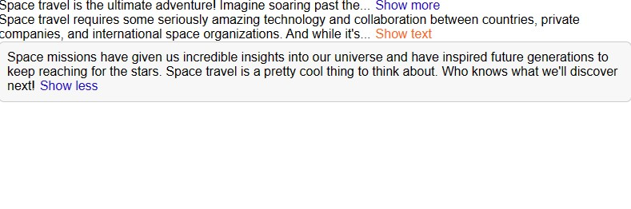

# React Challenge Text Expander 💬

## Features

- React Typescript
- useState and state management
- prop types
- typescript eslint

## Screenshots



## Run Locally

Clone the project

```bash
  git clone https://link-to-project
```

Go to the project directory

```bash
  cd my-project
```

Install dependencies

```bash
  npm install
```

Start the server

```bash
  npm start
```

## Acknowledgements

This my finished React Challenge Text Expander Challenge PART- 2 - #1 based on A Ultimate React Course by Jonas Schmedtmann

As the description suggests, the original design was done by Jonas Schmedtmann and was part of a Ultimate React Course which I highly recommend. https://www.udemy.com/course/the-ultimate-react-course/
